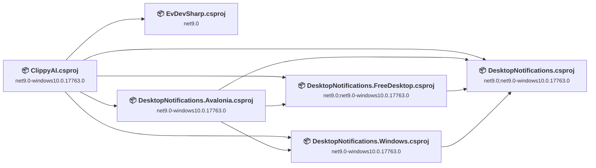
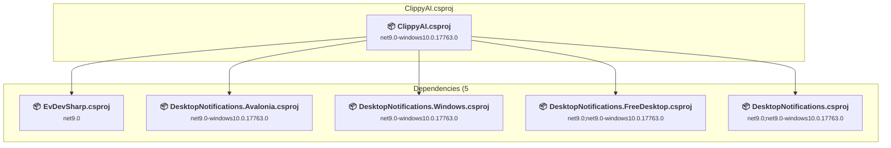
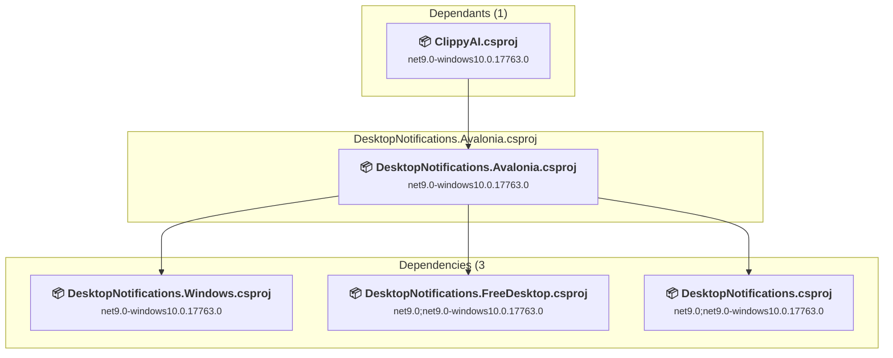
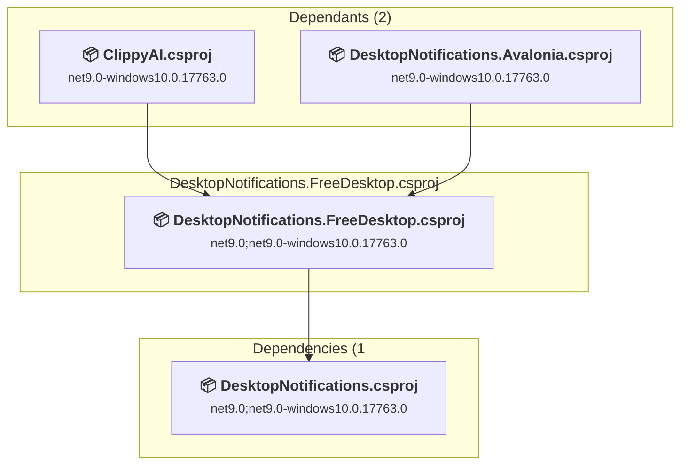
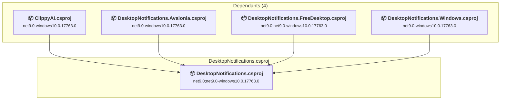
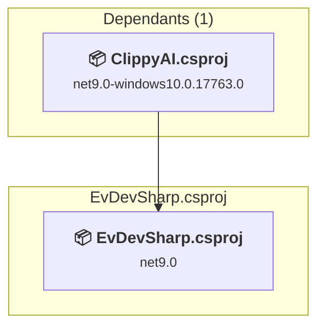

# Projects and dependencies analysis

This document provides a comprehensive overview of the projects and their dependencies in the context of upgrading to .NETCoreApp,Version=v10.0.

## Table of Contents

- [Executive Summary](#executive-Summary)
  - [Highlevel Metrics](#highlevel-metrics)
  - [Projects Compatibility](#projects-compatibility)
  - [Package Compatibility](#package-compatibility)
  - [API Compatibility](#api-compatibility)
- [Aggregate NuGet packages details](#aggregate-nuget-packages-details)
- [Top API Migration Challenges](#top-api-migration-challenges)
  - [Technologies and Features](#technologies-and-features)
  - [Most Frequent API Issues](#most-frequent-api-issues)
- [Projects Relationship Graph](#projects-relationship-graph)
- [Project Details](#project-details)

  - [ClippyAI\ClippyAI.csproj](#clippyaiclippyaicsproj)
  - [ClippyAI\Libs\DesktopNotificationsNet8\DesktopNotifications.Avalonia\DesktopNotifications.Avalonia.csproj](#clippyailibsdesktopnotificationsnet8desktopnotificationsavaloniadesktopnotificationsavaloniacsproj)
  - [ClippyAI\Libs\DesktopNotificationsNet8\DesktopNotifications.FreeDesktop\DesktopNotifications.FreeDesktop.csproj](#clippyailibsdesktopnotificationsnet8desktopnotificationsfreedesktopdesktopnotificationsfreedesktopcsproj)
  - [ClippyAI\Libs\DesktopNotificationsNet8\DesktopNotifications.Windows\DesktopNotifications.Windows.csproj](#clippyailibsdesktopnotificationsnet8desktopnotificationswindowsdesktopnotificationswindowscsproj)
  - [ClippyAI\Libs\DesktopNotificationsNet8\DesktopNotifications\DesktopNotifications.csproj](#clippyailibsdesktopnotificationsnet8desktopnotificationsdesktopnotificationscsproj)
  - [ClippyAI\Libs\evdev-sharp\EvDevSharp\EvDevSharp.csproj](#clippyailibsevdev-sharpevdevsharpevdevsharpcsproj)

## Executive Summary

### Highlevel Metrics

| Metric | Count | Status |
| :--- | :---: | :--- |
| Total Projects | 6 | All require upgrade |
| Total NuGet Packages | 22 | 1 need upgrade |
| Total Code Files | 71 |  |
| Total Code Files with Incidents | 13 |  |
| Total Lines of Code | 8795 |  |
| Total Number of Issues | 66 |  |
| Estimated LOC to modify | 59+ | at least 0,7% of codebase |

### Projects Compatibility

| Project | Target Framework | Difficulty | Package Issues | API Issues | Est. LOC Impact | Description |
| :--- | :---: | :---: | :---: | :---: | :---: | :--- |
| [ClippyAI\ClippyAI.csproj](#clippyaiclippyaicsproj) | net9.0-windows10.0.17763.0 | 🟢 Low | 0 | 55 | 55+ | WinForms, Sdk Style = True |
| [ClippyAI\Libs\DesktopNotificationsNet8\DesktopNotifications.Avalonia\DesktopNotifications.Avalonia.csproj](#clippyailibsdesktopnotificationsnet8desktopnotificationsavaloniadesktopnotificationsavaloniacsproj) | net9.0-windows10.0.17763.0 | 🟢 Low | 0 | 2 | 2+ | ClassLibrary, Sdk Style = True |
| [ClippyAI\Libs\DesktopNotificationsNet8\DesktopNotifications.FreeDesktop\DesktopNotifications.FreeDesktop.csproj](#clippyailibsdesktopnotificationsnet8desktopnotificationsfreedesktopdesktopnotificationsfreedesktopcsproj) | net9.0;net9.0-windows10.0.17763.0 | 🟢 Low | 0 | 0 |  | ClassLibrary, Sdk Style = True |
| [ClippyAI\Libs\DesktopNotificationsNet8\DesktopNotifications.Windows\DesktopNotifications.Windows.csproj](#clippyailibsdesktopnotificationsnet8desktopnotificationswindowsdesktopnotificationswindowscsproj) | net9.0-windows10.0.17763.0 | 🟢 Low | 1 | 2 | 2+ | ClassLibrary, Sdk Style = True |
| [ClippyAI\Libs\DesktopNotificationsNet8\DesktopNotifications\DesktopNotifications.csproj](#clippyailibsdesktopnotificationsnet8desktopnotificationsdesktopnotificationscsproj) | net9.0;net9.0-windows10.0.17763.0 | 🟢 Low | 0 | 0 |  | ClassLibrary, Sdk Style = True |
| [ClippyAI\Libs\evdev-sharp\EvDevSharp\EvDevSharp.csproj](#clippyailibsevdev-sharpevdevsharpevdevsharpcsproj) | net9.0 | 🟢 Low | 0 | 0 |  | ClassLibrary, Sdk Style = True |

### Package Compatibility

| Status | Count | Percentage |
| :--- | :---: | :---: |
| ✅ Compatible | 21 | 95,5% |
| ⚠️ Incompatible | 0 | 0,0% |
| 🔄 Upgrade Recommended | 1 | 4,5% |
| ***Total NuGet Packages*** | ***22*** | ***100%*** |

### API Compatibility

| Category | Count | Impact |
| :--- | :---: | :--- |
| 🔴 Binary Incompatible | 0 | High - Require code changes |
| 🟡 Source Incompatible | 34 | Medium - Needs re-compilation and potential conflicting API error fixing |
| 🔵 Behavioral change | 25 | Low - Behavioral changes that may require testing at runtime |
| ✅ Compatible | 10091 |  |
| ***Total APIs Analyzed*** | ***10150*** |  |

## Aggregate NuGet packages details

| Package | Current Version | Suggested Version | Projects | Description |
| :--- | :---: | :---: | :--- | :--- |
| Avalonia | 11.1.4 |  | [DesktopNotifications.Avalonia.csproj](#clippyailibsdesktopnotificationsnet8desktopnotificationsavaloniadesktopnotificationsavaloniacsproj) | ✅Compatible |
| Avalonia | 11.3.12 |  | [ClippyAI.csproj](#clippyaiclippyaicsproj) | ✅Compatible |
| Avalonia.Desktop | 11.3.12 |  | [ClippyAI.csproj](#clippyaiclippyaicsproj) | ✅Compatible |
| Avalonia.Diagnostics | 11.3.12 |  | [ClippyAI.csproj](#clippyaiclippyaicsproj) | ✅Compatible |
| Avalonia.Fonts.Inter | 11.3.12 |  | [ClippyAI.csproj](#clippyaiclippyaicsproj) | ✅Compatible |
| Avalonia.Themes.Fluent | 11.3.12 |  | [ClippyAI.csproj](#clippyaiclippyaicsproj) | ✅Compatible |
| CommunityToolkit.Mvvm | 8.4.0 |  | [ClippyAI.csproj](#clippyaiclippyaicsproj) | ✅Compatible |
| DirectShowLib.Net | 3.0.0 |  | [ClippyAI.csproj](#clippyaiclippyaicsproj) | ✅Compatible |
| Emgu.CV | 4.12.0.5764 |  | [ClippyAI.csproj](#clippyaiclippyaicsproj) | ✅Compatible |
| Emgu.CV.runtime.mini.ubuntu-x64 | 4.12.0.5764 |  | [ClippyAI.csproj](#clippyaiclippyaicsproj) | ✅Compatible |
| Emgu.CV.runtime.mini.windows | 4.12.0.5764 |  | [ClippyAI.csproj](#clippyaiclippyaicsproj) | ✅Compatible |
| Microsoft.Data.Sqlite | 10.0.3 |  | [ClippyAI.csproj](#clippyaiclippyaicsproj) | ✅Compatible |
| Microsoft.Extensions.DependencyInjection | 10.0.3 |  | [ClippyAI.csproj](#clippyaiclippyaicsproj) | ✅Compatible |
| Microsoft.Toolkit.Uwp.Notifications | 7.1.3 |  | [DesktopNotifications.Windows.csproj](#clippyailibsdesktopnotificationsnet8desktopnotificationswindowsdesktopnotificationswindowscsproj) | ✅Compatible |
| Npgsql | 10.0.1 |  | [ClippyAI.csproj](#clippyaiclippyaicsproj) | ✅Compatible |
| Packaging.Targets | 0.1.232 |  | [ClippyAI.csproj](#clippyaiclippyaicsproj) [DesktopNotifications.Avalonia.csproj](#clippyailibsdesktopnotificationsnet8desktopnotificationsavaloniadesktopnotificationsavaloniacsproj) [DesktopNotifications.csproj](#clippyailibsdesktopnotificationsnet8desktopnotificationsdesktopnotificationscsproj) [DesktopNotifications.FreeDesktop.csproj](#clippyailibsdesktopnotificationsnet8desktopnotificationsfreedesktopdesktopnotificationsfreedesktopcsproj) [DesktopNotifications.Windows.csproj](#clippyailibsdesktopnotificationsnet8desktopnotificationswindowsdesktopnotificationswindowscsproj) [EvDevSharp.csproj](#clippyailibsevdev-sharpevdevsharpevdevsharpcsproj) | ✅Compatible |
| ReactiveUI | 23.1.1 |  | [ClippyAI.csproj](#clippyaiclippyaicsproj) | ✅Compatible |
| ReactiveUI.Avalonia | 11.4.3 |  | [ClippyAI.csproj](#clippyaiclippyaicsproj) | ✅Compatible |
| SSH.NET | 2025.1.0 |  | [ClippyAI.csproj](#clippyaiclippyaicsproj) | ✅Compatible |
| System.Configuration.ConfigurationManager | 10.0.3 |  | [ClippyAI.csproj](#clippyaiclippyaicsproj) | ✅Compatible |
| System.Drawing.Common | 8.0.10 | 10.0.3 | [DesktopNotifications.Windows.csproj](#clippyailibsdesktopnotificationsnet8desktopnotificationswindowsdesktopnotificationswindowscsproj) | Ein NuGet-Paketupgrade wird empfohlen |
| Tmds.DBus | 0.20.0 |  | [DesktopNotifications.FreeDesktop.csproj](#clippyailibsdesktopnotificationsnet8desktopnotificationsfreedesktopdesktopnotificationsfreedesktopcsproj) | ✅Compatible |

## Top API Migration Challenges

### Technologies and Features

| Technology | Issues | Percentage | Migration Path |
| :--- | :---: | :---: | :--- |
| Legacy Configuration System | 34 | 57,6% | Legacy XML-based configuration system (app.config/web.config) that has been replaced by a more flexible configuration model in .NET Core. The old system was rigid and XML-based. Migrate to Microsoft.Extensions.Configuration with JSON/environment variables; use System.Configuration.ConfigurationManager NuGet package as interim bridge if needed. |

### Most Frequent API Issues

| API | Count | Percentage | Category |
| :--- | :---: | :---: | :--- |
| T:System.Configuration.ConfigurationManager | 17 | 28,8% | Source Incompatible |
| P:System.Configuration.ConfigurationManager.AppSettings | 17 | 28,8% | Source Incompatible |
| T:System.Net.Http.HttpContent | 12 | 20,3% | Behavioral Change |
| P:System.Environment.OSVersion | 4 | 6,8% | Behavioral Change |
| M:System.Net.Http.HttpContent.ReadAsStreamAsync(System.Threading.CancellationToken) | 3 | 5,1% | Behavioral Change |
| T:System.Uri | 3 | 5,1% | Behavioral Change |
| M:System.Uri.#ctor(System.String) | 3 | 5,1% | Behavioral Change |

## Projects Relationship Graph

Legend:
📦 SDK-style project
⚙️ Classic project

## Project Details

### ClippyAI\ClippyAI.csproj

#### Project Info

- **Current Target Framework:** net9.0-windows10.0.17763.0
- **Proposed Target Framework:** net10.0-windows
- **SDK-style**: True
- **Project Kind:** WinForms
- **Dependencies**: 5
- **Dependants**: 0
- **Number of Files**: 40
- **Number of Files with Incidents**: 6
- **Lines of Code**: 6222
- **Estimated LOC to modify**: 55+ (at least 0,9% of the project)

#### Dependency Graph

Legend:
📦 SDK-style project
⚙️ Classic project

### API Compatibility

| Category | Count | Impact |
| :--- | :---: | :--- |
| 🔴 Binary Incompatible | 0 | High - Require code changes |
| 🟡 Source Incompatible | 34 | Medium - Needs re-compilation and potential conflicting API error fixing |
| 🔵 Behavioral change | 21 | Low - Behavioral changes that may require testing at runtime |
| ✅ Compatible | 8692 |  |
| ***Total APIs Analyzed*** | ***8747*** |  |

#### Project Technologies and Features

| Technology | Issues | Percentage | Migration Path |
| :--- | :---: | :---: | :--- |
| Legacy Configuration System | 34 | 61,8% | Legacy XML-based configuration system (app.config/web.config) that has been replaced by a more flexible configuration model in .NET Core. The old system was rigid and XML-based. Migrate to Microsoft.Extensions.Configuration with JSON/environment variables; use System.Configuration.ConfigurationManager NuGet package as interim bridge if needed. |

### ClippyAI\Libs\DesktopNotificationsNet8\DesktopNotifications.Avalonia\DesktopNotifications.Avalonia.csproj

#### Project Info

- **Current Target Framework:** net9.0-windows10.0.17763.0
- **Proposed Target Framework:** net10.0--windows10.0.17763.0
- **SDK-style**: True
- **Project Kind:** ClassLibrary
- **Dependencies**: 3
- **Dependants**: 1
- **Number of Files**: 1
- **Number of Files with Incidents**: 2
- **Lines of Code**: 56
- **Estimated LOC to modify**: 2+ (at least 3,6% of the project)

#### Dependency Graph

Legend:
📦 SDK-style project
⚙️ Classic project

### API Compatibility

| Category | Count | Impact |
| :--- | :---: | :--- |
| 🔴 Binary Incompatible | 0 | High - Require code changes |
| 🟡 Source Incompatible | 0 | Medium - Needs re-compilation and potential conflicting API error fixing |
| 🔵 Behavioral change | 2 | Low - Behavioral changes that may require testing at runtime |
| ✅ Compatible | 32 |  |
| ***Total APIs Analyzed*** | ***34*** |  |

### ClippyAI\Libs\DesktopNotificationsNet8\DesktopNotifications.FreeDesktop\DesktopNotifications.FreeDesktop.csproj

#### Project Info

- **Current Target Framework:** net9.0;net9.0-windows10.0.17763.0
- **Proposed Target Framework:** net9.0;net9.0-windows10.0.17763.0;net10.0;net10.0--windows10.0.17763.0
- **SDK-style**: True
- **Project Kind:** ClassLibrary
- **Dependencies**: 1
- **Dependants**: 2
- **Number of Files**: 3
- **Number of Files with Incidents**: 1
- **Lines of Code**: 298
- **Estimated LOC to modify**: 0+ (at least 0,0% of the project)

#### Dependency Graph

Legend:
📦 SDK-style project
⚙️ Classic project

### API Compatibility

| Category | Count | Impact |
| :--- | :---: | :--- |
| 🔴 Binary Incompatible | 0 | High - Require code changes |
| 🟡 Source Incompatible | 0 | Medium - Needs re-compilation and potential conflicting API error fixing |
| 🔵 Behavioral change | 0 | Low - Behavioral changes that may require testing at runtime |
| ✅ Compatible | 213 |  |
| ***Total APIs Analyzed*** | ***213*** |  |

### ClippyAI\Libs\DesktopNotificationsNet8\DesktopNotifications.Windows\DesktopNotifications.Windows.csproj

#### Project Info

- **Current Target Framework:** net9.0-windows10.0.17763.0
- **Proposed Target Framework:** net10.0--windows10.0.17763.0
- **SDK-style**: True
- **Project Kind:** ClassLibrary
- **Dependencies**: 1
- **Dependants**: 2
- **Number of Files**: 3
- **Number of Files with Incidents**: 2
- **Lines of Code**: 787
- **Estimated LOC to modify**: 2+ (at least 0,3% of the project)

#### Dependency Graph

Legend:
📦 SDK-style project
⚙️ Classic project

### API Compatibility

| Category | Count | Impact |
| :--- | :---: | :--- |
| 🔴 Binary Incompatible | 0 | High - Require code changes |
| 🟡 Source Incompatible | 0 | Medium - Needs re-compilation and potential conflicting API error fixing |
| 🔵 Behavioral change | 2 | Low - Behavioral changes that may require testing at runtime |
| ✅ Compatible | 425 |  |
| ***Total APIs Analyzed*** | ***427*** |  |

### ClippyAI\Libs\DesktopNotificationsNet8\DesktopNotifications\DesktopNotifications.csproj

#### Project Info

- **Current Target Framework:** net9.0;net9.0-windows10.0.17763.0
- **Proposed Target Framework:** net9.0;net9.0-windows10.0.17763.0;net10.0;net10.0--windows10.0.17763.0
- **SDK-style**: True
- **Project Kind:** ClassLibrary
- **Dependencies**: 0
- **Dependants**: 4
- **Number of Files**: 9
- **Number of Files with Incidents**: 1
- **Lines of Code**: 225
- **Estimated LOC to modify**: 0+ (at least 0,0% of the project)

#### Dependency Graph

Legend:
📦 SDK-style project
⚙️ Classic project

### API Compatibility

| Category | Count | Impact |
| :--- | :---: | :--- |
| 🔴 Binary Incompatible | 0 | High - Require code changes |
| 🟡 Source Incompatible | 0 | Medium - Needs re-compilation and potential conflicting API error fixing |
| 🔵 Behavioral change | 0 | Low - Behavioral changes that may require testing at runtime |
| ✅ Compatible | 84 |  |
| ***Total APIs Analyzed*** | ***84*** |  |

### ClippyAI\Libs\evdev-sharp\EvDevSharp\EvDevSharp.csproj

#### Project Info

- **Current Target Framework:** net9.0
- **Proposed Target Framework:** net10.0
- **SDK-style**: True
- **Project Kind:** ClassLibrary
- **Dependencies**: 0
- **Dependants**: 1
- **Number of Files**: 21
- **Number of Files with Incidents**: 1
- **Lines of Code**: 1207
- **Estimated LOC to modify**: 0+ (at least 0,0% of the project)

#### Dependency Graph

Legend:
📦 SDK-style project
⚙️ Classic project

### API Compatibility

| Category | Count | Impact |
| :--- | :---: | :--- |
| 🔴 Binary Incompatible | 0 | High - Require code changes |
| 🟡 Source Incompatible | 0 | Medium - Needs re-compilation and potential conflicting API error fixing |
| 🔵 Behavioral change | 0 | Low - Behavioral changes that may require testing at runtime |
| ✅ Compatible | 645 |  |
| ***Total APIs Analyzed*** | ***645*** |  |

