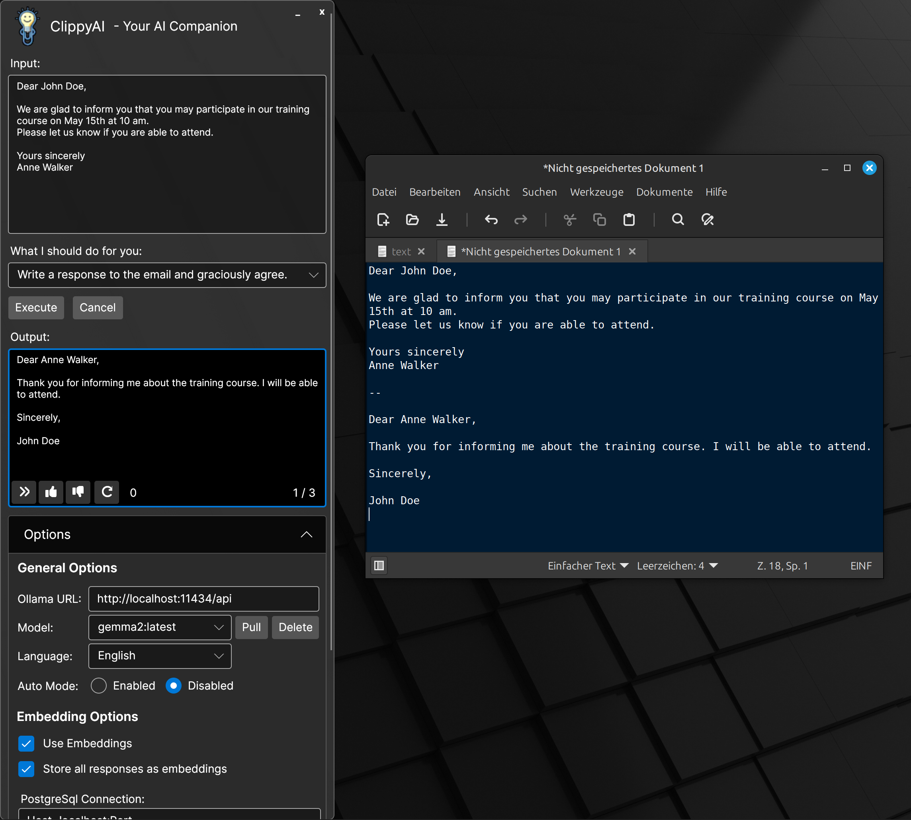

**ClippyAI**
================

**Overview**

ClippyAI is an innovative productivity tool that revolutionizes the way you interact with your computer. This
application takes notes from your clipboard and sends them along with a task to Ollama, a popular local AI service.
After being processed, the response will be available in the clipboard and can be pasted into any application the user is using.

**Features**

* **Highest Level of Data Privacy**: Your data stays your data and nothing leaves your PC. After installation, you can
even use this tool completely offline.
* **Clipboard Integration**: ClippyAI seamlessly integrates with your system's clipboard, capturing text instantly
after it is copied or cut. The clipboard's content can then be sent along with a task to the Ollama API. After execution, the output will be available in the clipboard, too.
* **Super Fast Response Times**: Thanks to the integration of a PostgreSQL vector database, your favorite generated outputs can be saved as templates. The usage of an embedding LLM enables ClippyAI to quickly find the best matching templates for your input. If no suitable template answer for your task is found, the output will be generated by the LLM in the classical way.  
* **Desktop Notifications**: System notifications inform the user about the task status.
* **Cross-Platform Support**: Developed with .NET and Avalonia, ClippyAI runs on Windows and Linux (X11), ensuring that users can enjoy its benefits regardless of their platform. Hotkeys allow the user to use ClippyAI easily, without interacting with the user interface.

**Example Use Cases**

* Copy an email and let ClippyAI write the response
* Copy some code from an IDE and let ClippyAI find an error
* Explain a complicated text to understand it better
* Translate a text into another language
* Summarize a long text in a few sentences

**Getting Started**

1. Install Ollama from [https://ollama.com/download](https://ollama.com/download).
2. Download the latest release of ClippyAI for your OS (Windows or Linux).
3. Run `setup.exe` on Windows or install the .deb/.rpm packages on Linux/X11 systems.
4. Run `ClippyAI` from the start menu of your OS and click on the tray icon to open it.
5. Click on `Options`, the `Pull` button and enter `gemma2` to let ClippyAI download and install the Google Gemma2 AI model to your local PC.
Please be patient, as the downloading can take a few minutes, depending on how fast your internet connection is.
6. Uncheck `Use Embeddings`, if you want to use the application without caching via an embedding database.

**Setting Up Embedding Database (optional)**
1. Install PostgreSQL database and pgai:
  1. Install via Docker (recommended):
      - Download the [https://raw.githubusercontent.com/MrDoe/ClippyAI/refs/heads/main/ClippyAI/Docker/docker-compose.yml](docker-compose.yml) file from this repository.
      - Open the command prompt/terminal and execute `docker-compose up` from the download directory. 
  2. Manual installation
      - See [https://github.com/timescale/pgai](https://github.com/timescale/pgai) for specific installation instructions.
  3. Cloud-based database from Timescale:
      - Go to [https://www.timescale.com/cloud](https://www.timescale.com/cloud) for setup instructions.
2. Set the environment variable for Ollama
    - Windows:
        - Add `OLLAMA_HOST=0.0.0.0` to the user or system environment variables.
    - Linux:
        - Edit file `/etc/systemd/system/ollama.service`.
        - Add `Environment="OLLAMA_HOST=0.0.0.0"` after `Environment="PATH=..."`.
        - Execute `sudo systemctl daemon-reload && sudo systemctl restart ollama`.
3. Start ClippyAI and edit the Postgres SQL connection string if necessary. Default values should be fine for installations via `docker-compose`.
9. Click on `Options`, the `Pull` button and enter `nomic-embed-text`, which is mandatory for calculating the embeddings.

**Using ClippyAI**

1. Choose a task from the dropdown list.
2. Copy or cut some text from an application (e.g., email, chat, or document) via [Ctrl]+[C].
3. Click `Send` or use the keyboard shortcut [Ctrl]+[Alt]+[C] to send the clipboard contents with the task to the local LLM.
4. Review or paste ([Ctrl]+[V]) your generated task in the application where you need it.

**Disclaimer**

This tool is in an early development phase. Use it at your own risk. We take no responsibility, if it accidently deletes or overwrites your currently opened documents. (Take special care with the experimental keyboard output.

If you encounter any issues or having questions or new ideas about using ClippyAI, please open an issue here on GitHub.

**Future Plans**

Go to the issues page on this Github repo to see things I've planned for the future.

**Developers Wanted!**

ClippyAI is an open-source project that relies on contributions from passionate developers like you. If you're interested in joining the ClippyAI community and contributing to its development, here are some ways you can get
involved:

* **Bug Fixing**: Help me squash those pesky bugs that prevent users from enjoying the full potential of ClippyAI.
* **Feature Development**: There are several things in my mind on how to improve ClippyAI. Take a look at the issues page for open enhancements. You may also suggest new features or enhancements.
* **Testing**: Put ClippyAI through its paces and help me to identify areas where it can be improved.

To get started with contributing to ClippyAI, please submit your pull requests.

**Licensing & Terms**

ClippyAI is distributed under the terms of the [MIT License](/LICENSE.md). By using ClippyAI, you agree to abide by
the terms and conditions outlined in the license.

